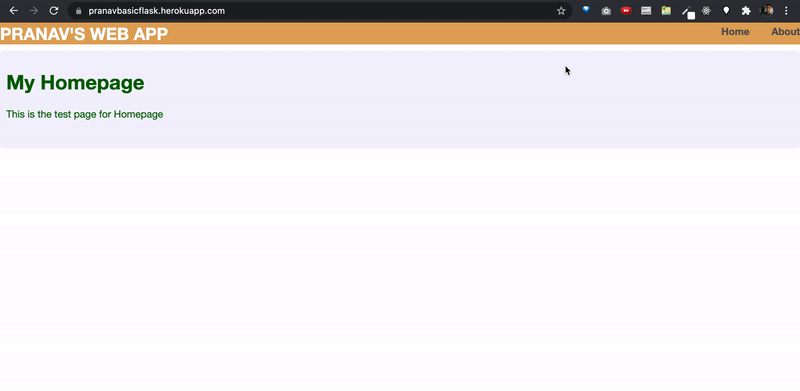

# python_basicFlaskSite
A basic flask app deployed to heroku
  

  
  
## For Mac:
### To create a virtual environment for app: 
run in terminal `python3 -m venv virtual` in a folder containg the folder that has all files in repository.   
To run python from that virtual env `virtual/bin/python3 <SCRIPT-NAME>`  
To install flask in env `virtual/bin/pip3 install flask`  
To run it `virtual/bin/python3 <SCRIPT-NAME>`  
 
### When trying to run locally on localhost:5000 and there is already an app runnin on that port:  
To find running ports:  
`sudo lsof -i :5000`   
To kill it  
`kill -9 <pid>`  
 
### To deply to heroku: 
First login to heroku `heroku login`   
Create a heroku app with a unique name `heroku create <APP-NAME>`   
To view all your apps on heroku `heroku apps`  
To see all dependecies `virtual/bin/pip3 freeze`  
To install gunicorn in env `virtual/bin/pip3 install gunicorn`   
To create requirements file for heroku `virtual/bin/pip3 freeze > requirements.txt`   
Ensurer "requirements.txt" file is in Demo folder   
Create a file called "Procfile" wiithout an extension type in Demo folder   
Into the "Procfile" file write and save "web: gunicorn basicFlask:app"   
Create a file called "runtime.txt" and in it write and save "python-3.9.5" or other supported runtime versions   
`git init` 
`git add .` 
`git commit -m "first commit`  
To point to app to push  
`heroku git:remote -a <APP-NAME>`  
To push it to heroku  
`git push heroku master` 
 
#### To push updates:
Make sure you are pointing to the right app 
`heroku apps` 
`heroku info` 
`git add .` 
`git commit -m "second commit"` 
`heroku git:remote -a <APP-NAME>` 
`git push heroku master` 
